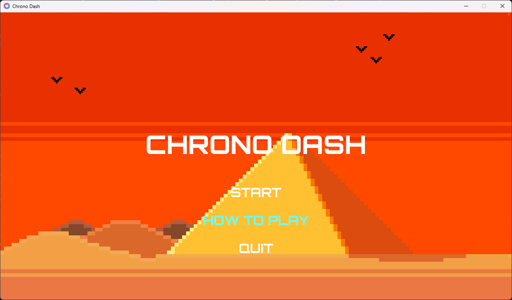
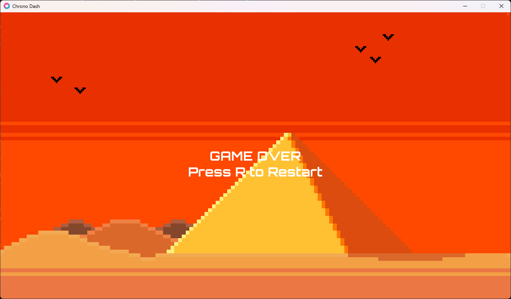

<h1 align="center">ChronoDash</h1>
Hi 👋, this is my first ever game created with Lua. 

## About the game
This game was developed using the Lua programming language and the LÖVE game engine. All pixel art was personally created by me where i just used google and reddit for the some ideas.
I used the "piskel" and "aseprite" software to create these pixels. For the background sound i found it on "Pixabay" and created the sound effect by myself with "jsfxr"
It is a 2D pixel-art game, which offers an adventure where you control a magical character who must dodge obstacles, use the time control ability to slow down the enviroment, and survive to achieve the highest score.

## Game Menu

The main menu allows you to start the game, see the controls and quit the game.

## How To Play

On this page, you can learn how to play the game and what each gemstone represents.

## In Game Scene

Here, you can see the mage in action, jumping over obstacles. Carefully placed obstacles test your agility and precision.

## Game Over Scene

The game over screen appears when you lose all your lives. Here you can restart the game by pressing the key 'R' on your keyboard.

## Conclusion
This game is the result of many hours of hard work and creativity. Since it's my first game created with Lua, I wanted it to be easy to play and accessible.
I had a lot of fun and learned so much about Lua and the LÖVE framework while developing this game.

## Future Plans
These can be added in the futureto improve the game experience.
- Add new obstacles
- Implement a high-score list
- Create new levels with different environments
